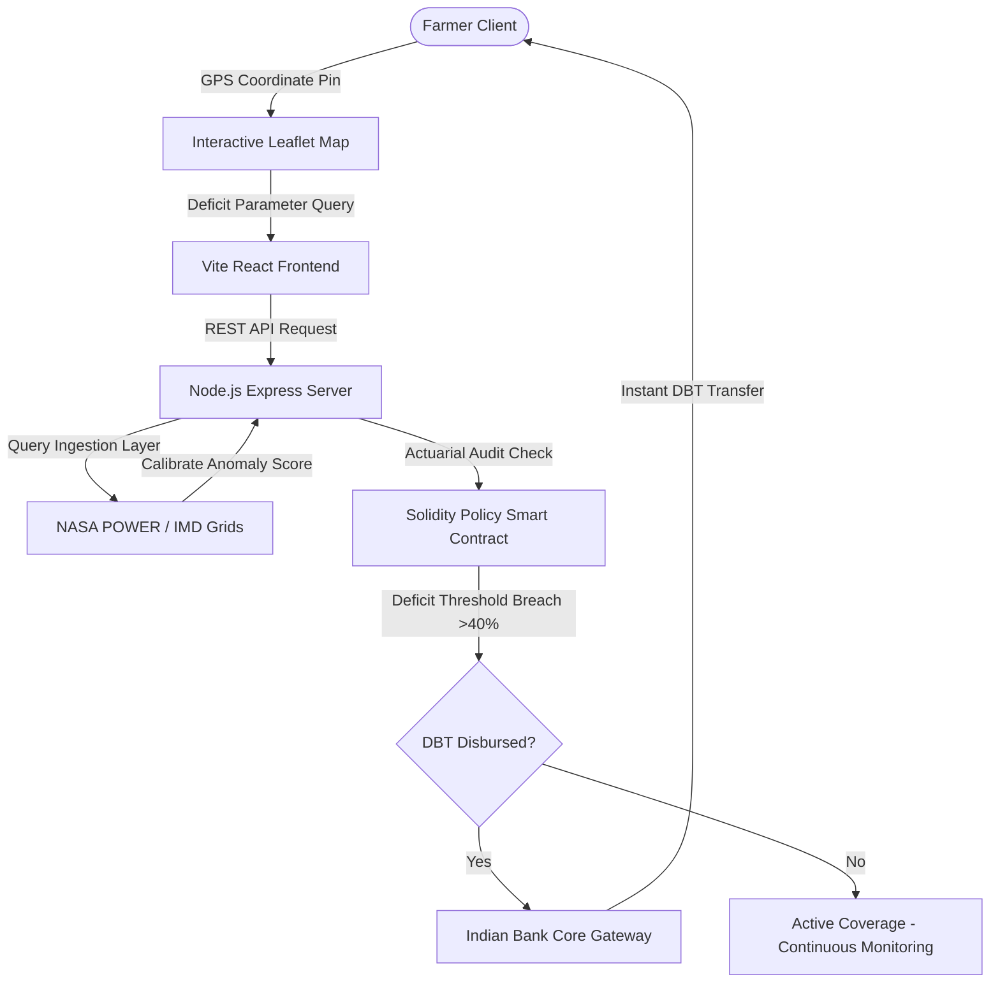

<div align="center">


# KrishiShield
### Automated Parametric Crop Insurance & Zero-Touch DBT Settlement Protocol

[](https://react.dev)
[](https://vitejs.dev)
[](https://console.groq.com/)
[](https://sqlite.org/)
[](LICENSE)

**Stop delayed claims processing. Automate monsoonal risk settlements in under 2 seconds.**  
Growth-stage risk weighting · Expected Value (EV) calculator · Multi-lingual vernacular support · Print-ready certificate

Built for **ByteBlaze 12-Hour Hackathon** (July 17, 2026)  
Organized by the **Department of Quantum Mathematics, Saveetha School of Engineering (SIMATS)**

---

### 👥 Team Vyomex
Hari Krishnan R &nbsp;•&nbsp; Jackson JP &nbsp;•&nbsp; Immanuel Thomas J &nbsp;•&nbsp; Jenish S

</div>

---

## 📸 System Architecture



---

## 💡 The Problem

Traditional crop insurance under PMFBY requires manual physical field inspections and Crop Cutting Experiments (CCEs) when monsoonal variations strike. This leads to administrative corruption, disputed reports, and delayed claim payouts spanning 6 to 12 months, driving farmers into high-interest informal debts. 

KrishiShield resolves this by implementing a parametric weather-index protocol. By monitoring gridded climate data and triggering payouts decantrally through smart contracts directly into registered Aadhaar bank wallets (DBT), we eliminate delays and middle-men completely.

---

## ✨ Features

| Feature Module | What it does |
|----------------|-------------|
| 🌾 **Growth-Stage Weighting** | Evaluates precipitation deficits differently across active crop growth stages (Sowing, Tillering, Flowering, Maturity) based on physiological vulnerability. |
| 📊 **EV Premium Simulator** | Embedded math simulator showing the Net Expected Value (EV) of coverage across three distinct season scenarios (Normal, Moderate, Severe). |
| 🛰️ **Micro-Climate Correction** | Calculates a geocoded coordinate offset factor using NASA POWER grid anomalies to account for local blocks variance from district averages. |
| 🖨️ **Printable Loss Certificate** | High-fidelity PMFBY-compliant printable certificate, styled with dual frames and official watermarks, optimized to fit on a single A4 page. |
| 🗺️ **Interactive Leaflet Map** | Pins farmlands with a custom SVG emerald pulsing pin that triggers reverse-geocoding coordinates instantly. |
| 🎚️ **Custom React Dropdowns** | Custom dropdown selectors that bypass generic browser scrollbars for clean UI consistency. |
| 🗣️ **Mute & Voice Advisory** | Features bilingual voice advisory controls alongside a header-mounted mute toggle to control synthesized Web Audio API sounds. |
| 🏛️ **Vernacular Translations** | Localized dashboard interfaces spanning English (`en`), Hindi (`hi`), Tamil (`ta`), Telugu (`te`), Marathi (`mr`), and Punjabi (`pa`). |

---

## 🛠️ Tech Stack

* **Framework**: React 19 SPA (Hooks, Context, Router scroll guards)
* **Build System**: Vite 8 (Hot reloading & compressed production bundling)
* **API Ingestions**: NASA POWER Agricultural Diagnostics & Open-Meteo REST API
* **Database**: SQLite3 (Historical audit logging & authentication schemas)
* **Audio Synthesizer**: Native Web Audio API (Offline sound synthesis)
* **Styling**: Vanilla CSS (Cyberpunk/Glassmorphic grids, sticky sub-headers, print rules)

---

## 🗄️ Telemetry Schema

KrishiShield structures risk outputs and blockchain triggers using a strict JSON payload format:

```json
{
  "assessment_id": "KS-897F3-2026",
  "risk_score": 78,
  "parametric_trigger": true,
  "recommendation": "CRITICAL RISK: Payout Activated",
  "crop_profile": {
    "crop_type": "Rice",
    "season": "Kharif",
    "water_need": "High"
  },
  "premium_breakdown": {
    "gross_premium": 1500,
    "net_premium_due": 300,
    "gov_subsidy": 1200
  },
  "claim_settlement": {
    "status": "SETTLED",
    "total_payout": 45000,
    "txn_hash": "0x7f3a9b2c4d5e6f7890a1b2c3d4e5f6a7b8c9d0e"
  }
}
```

---

## 🚀 Running Locally

### 1. Set up environment variables
Create a `.env` file in the `/backend` directory:
```env
GROQ_API_KEY=your_groq_api_key_here
PORT=3001
```

### 2. Install dependencies & Run Backend
```bash
cd backend
npm install
node server.js
```

### 3. Install dependencies & Run Frontend
```bash
cd ../frontend
npm install
npm run dev
```
Open `http://localhost:5174` in your browser.

---

## 🤝 Hackathon Partners & Sponsors
Proudly backed by partners powering **BYTEBLAZE 2026**:

* **Shield Sponsor**: DB0247
* **Ecosystem Partner**: Wyntrix (Specialized Internship Programs)
* **Internship Sponsor**: Oxis
* **Industry Partner**: Altrusity
* **Media Partner**: Eventopia
* **Community Partner**: Cybrian
