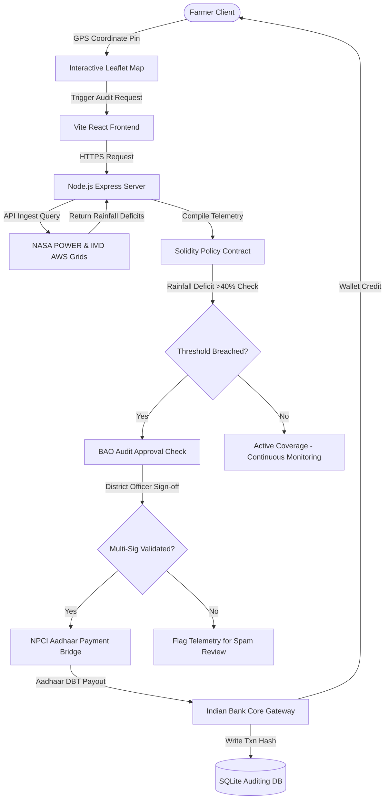

<div align="center">


# KrishiShield
### Automated Parametric Crop Insurance & Zero-Touch DBT Settlement Protocol

[](https://react.dev)
[](https://vitejs.dev)
[](https://console.groq.com/)
[](https://sqlite.org/)
[](LICENSE)

**Stop delayed claims processing. Automate monsoonal risk settlements in under 2 seconds.**  
Growth-stage risk weighting · Expected Value (EV) calculator · Multi-lingual vernacular support · Print-ready certificate

Built for **ByteBlaze 12-Hour Hackathon** (July 17, 2026)  
Organized by the **Department of Quantum Mathematics, Saveetha School of Engineering (SIMATS)**

---

### 👥 Team Vyomex
Hari Krishnan R &nbsp;•&nbsp; Jackson JP &nbsp;•&nbsp; Immanuel Thomas J &nbsp;•&nbsp; Jenish S

</div>

---

## 📸 System Architecture



---

## 💡 The Problem (Indian Agricultural Context)

Traditional crop insurance under PMFBY (Pradhan Mantri Fasal Bima Yojana) requires manual physical field inspections and Crop Cutting Experiments (CCEs) when monsoonal variations strike. This leads to administrative corruption, disputed reports, and delayed claim payouts spanning 6 to 12 months. 

### 🇮🇳 Ground Realities & Current Affairs:
* **The Sowing Crisis**: In recent agricultural seasons, states like **Karnataka declared severe drought across 223 out of 236 taluks**, impacting over 48 lakh hectares of cultivated lands with crop damage estimates exceeding **₹35,000 Crores**.
* **The Debt Trap**: Lacking cash reserves, smallholder farmers (who make up **86% of Indian landholders**) wait up to a year for crop-loss settlements. To buy seeds for the next sowing cycle, they are forced to borrow from local moneylenders at interest rates of **24% to 36%**, exacerbating rural distress and farmer suicides.
* **The CCE Overhead**: Conducting over **70 Lakh manual CCEs** annually costs insurance carriers billions in administration and leads to opaque, delayed, or rejected claims.

---

## 🛡️ Multi-Sig Governance & Spam Prevention

Fully automated, oracle-driven crop payouts are vulnerable to satellite sensor glitches, data-source downtime, or coordinate spoofing attempts to siphon escrow funds. To address this risk:

1. **BAO Dual-Authorization**: KrishiShield integrates a **Block Agricultural Officer (BAO)** cryptographic verification layer.
2. **Review Checkpoint**: Payouts are not sent immediately upon weather breaches. Instead, a district governance portal queues the assessment for approval. 
3. **Anti-Spam Filter**: Local block officers cross-validate coordinates against ground records to filter out false or spam claims before signing off on the direct transfer, combining objective data speed with governance safety.

---

## ⚡ Digital Public Infrastructure (DPI) Alignment

KrishiShield aligns directly with India's **India Stack** initiatives to route claims transparently:
* **Aadhaar Identity Stack**: Resolves farmer authentication instantly, linked to digital land registry records (e.g., Bhoomi/Bhulekh portals).
* **Aadhaar-Enabled Payments (AePS)**: Direct benefit transfer payouts are routed via the **NPCI Aadhaar Payment Bridge (APB)** directly into the bank account linked to the farmer's 12-digit Aadhaar.
* **Scale Validation**: Emulates the PM-KISAN subsidy model, which has successfully disbursed over **₹3.2 Lakh Crore** directly to farmers, eliminating leaks, brokers, and administrative delays.

---

## 📷 Groq Multimodal Vision AI Fraud Interception

To prevent crop insurance fraud (such as farmers uploading stock photos, screen captures of other farms, or pictures of incorrect crops to trigger fake claims), KrishiShield incorporates a **multimodal verification pipeline**:

1. **Crop Photo Upload**: Farmers upload a real-time photo of their crop field when running the climate assessment.
2. **Groq LLaVA Vision Verification**: The backend dispatches the base64-encoded image to **Groq's LLaVA-3.2-11b Vision Model** (`llama-3.2-11b-vision-preview`).
3. **Automated Forensic Analysis**: The model performs heuristic analysis checking:
   * **Crop Consistency**: Does the crop in the photo match the claimed choice (e.g., Rice)?
   * **Soil Consistency**: Does the soil in the photo match the selected category (e.g., Alluvial)?
   * **Dryness Inspection**: Are physical signs of drought/water stress visually observable?
   * **Fraud Verdict**: Classifies risk index as **LOW**, **MEDIUM**, or **HIGH**, generating auditor verification logs visible directly inside the Block Officer's claim approval desk.

---

## ✨ Features

| Feature Module | What it does |
|----------------|-------------|
| 🌾 **Growth-Stage Weighting** | Evaluates precipitation deficits differently across active crop growth stages (Sowing, Tillering, Flowering, Maturity) based on physiological vulnerability. |
| 📊 **EV Premium Simulator** | Embedded math simulator showing the Net Expected Value (EV) of coverage across three distinct season scenarios (Normal, Moderate, Severe). |
| 🛰️ **Micro-Climate Correction** | Calculates a geocoded coordinate offset factor using NASA POWER grid anomalies to account for local blocks variance from district averages. |
| 🖨️ **Printable Loss Certificate** | High-fidelity PMFBY-compliant printable certificate, styled with dual frames and official watermarks, optimized to fit on a single A4 page. |
| 🗺️ **Interactive Leaflet Map** | Pins farmlands with a custom SVG emerald pulsing pin that triggers reverse-geocoding coordinates instantly. |
| 🎚️ **Custom React Dropdowns** | Custom dropdown selectors that bypass generic browser scrollbars for clean UI consistency. |
| 🗣️ **Mute & Voice Advisory** | Features bilingual voice advisory controls alongside a header-mounted mute toggle to control synthesized Web Audio API sounds. |
| 🏛️ **Vernacular Translations** | Localized dashboard interfaces spanning English (`en`), Hindi (`hi`), Tamil (`ta`), Telugu (`te`), Marathi (`mr`), and Punjabi (`pa`). |

---

## 🛠️ Tech Stack

* **Framework**: React 19 SPA (Hooks, Context, Router scroll guards)
* **Build System**: Vite 8 (Hot reloading & compressed production bundling)
* **API Ingestions**: NASA POWER Agricultural Diagnostics & Open-Meteo REST API
* **Database**: SQLite3 (Historical audit logging & authentication schemas)
* **Audio Synthesizer**: Native Web Audio API (Offline sound synthesis)
* **Styling**: Vanilla CSS (Cyberpunk/Glassmorphic grids, sticky sub-headers, print rules)

---

## 🗄️ Telemetry Schema

KrishiShield structures risk outputs and blockchain triggers using a strict JSON payload format:

```json
{
  "assessment_id": "KS-897F3-2026",
  "risk_score": 78,
  "parametric_trigger": true,
  "recommendation": "CRITICAL RISK: Payout Activated",
  "crop_profile": {
    "crop_type": "Rice",
    "season": "Kharif",
    "water_need": "High"
  },
  "premium_breakdown": {
    "gross_premium": 1500,
    "net_premium_due": 300,
    "gov_subsidy": 1200
  },
  "claim_settlement": {
    "status": "SETTLED",
    "total_payout": 45000,
    "txn_hash": "0x7f3a9b2c4d5e6f7890a1b2c3d4e5f6a7b8c9d0e"
  }
}
```

---

## 🚀 Running Locally

### 1. Set up environment variables
Create a `.env` file in the `/backend` directory:
```env
GROQ_API_KEY=your_groq_api_key_here
PORT=3001
```

### 2. Install dependencies & Run Backend
```bash
cd backend
npm install
node server.js
```

### 3. Install dependencies & Run Frontend
```bash
cd ../frontend
npm install
npm run dev
```
Open `http://localhost:5174` in your browser.

---

## 🔐 Pre-Seeded Demo Login Credentials

For local testing, the following accounts are pre-seeded in the SQLite database:

* **🌾 Farmer Profile (Rajesh Kumar)**:
  * **Aadhaar Card Number**: `123456789012`
  * **Password**: `demo`
  * **Direct Benefit Balance**: Initialized at `₹96,000` with pre-populated grant ledger history.
* **👨‍💼 Block Agricultural Officer (BAO) Auditor**:
  * **Aadhaar Card Number**: `987654321098`
  * **Password**: `admin`
  * **Direct Benefit Balance**: `₹0` (auditor role).
